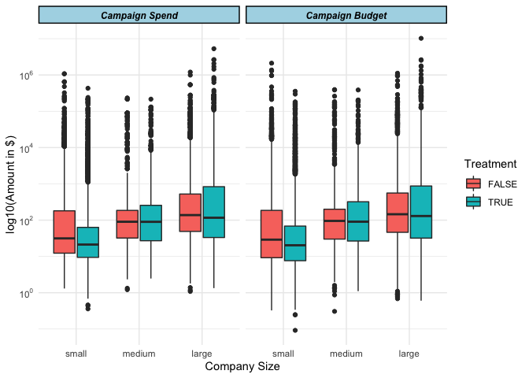
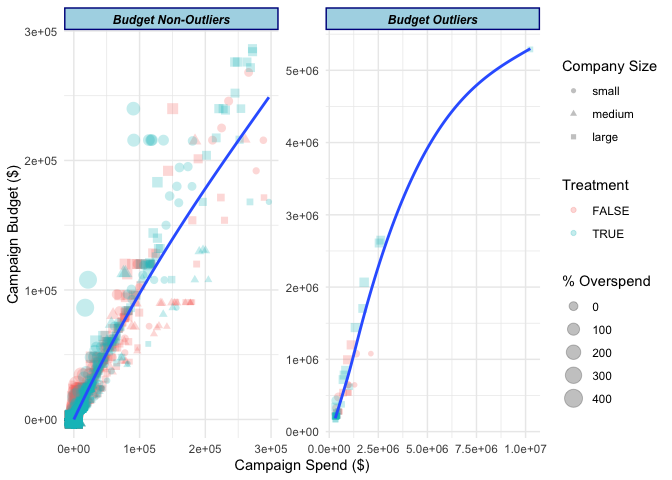
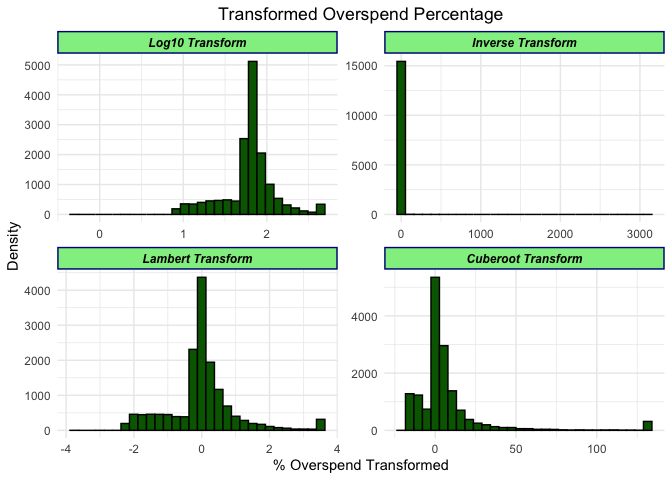
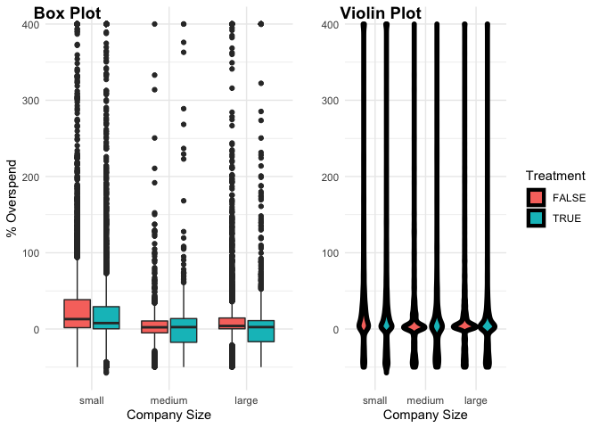

Twitter Advertising Campaign
================
Tolu Omotunde
Last compiled on 08 February, 2021

     

##### Import and explore dataset

    ## tibble [15,474 × 4] (S3: tbl_df/tbl/data.frame)
    ##  $ treatment      : Factor w/ 2 levels "FALSE","TRUE": 1 1 1 1 1 1 1 1 1 1 ...
    ##  $ company_size   : Factor w/ 3 levels "small","medium",..: 1 2 2 1 1 1 3 1 1 2 ...
    ##  $ campaign_spend : num [1:15474] 10.45 3.78 46.19 6.63 92.34 ...
    ##  $ campaign_budget: num [1:15474] 3.9 1.99 55.45 6.51 83.1 ...

     

#### Count number of missing values across the columns

    ##       treatment    company_size  campaign_spend campaign_budget 
    ##               0               0               0               0

     

#### Display percentage of adverts by company size and treatment

    ##          company_size
    ## treatment  small medium  large
    ##     FALSE 27.769  4.750 17.455
    ##     TRUE  29.753  4.472 15.801

There is a noticeable disparity between the percentage of companies in
the small, medium and large size groupings. This might introduce a bias
so it is worth taking into account in downstream analysis      

The next step is to visualize distribution of the campaign budget and
spending by company size and treatment to further understand the data. A
log transformation was taken due to the presence of heavy skewness.

<!-- -->

By eye-balling, the treatment group appears to have a slightly lower
median budget and spending for the small and large sized companies as
compared to the control group. The medium sized companies have roughly
the same median budget and spending in both the treatment and control.
The Inter-Quartile Range (IQR) of the medium and large sized companies
is larger in the treatment group compared to the control group. In the
small sized companies, the IQR is smaller in the treatment group
compared to the control group.      

#### Add Percentage change column

``` r
advert_df <- mutate(
    advert_df, percent_overspend = (
        (campaign_spend-campaign_budget)/campaign_budget
        )*100)
```

   
 

#### Visualize the campaign experiment using scatter plots in multiple dimensions

<!-- -->

The outliers are campaigns with budgets above and below 3 standard
deviations across the entire distribution.

Most of the campaigns with outlier budgets seems to be associated with
the treatment group, lower overspend and large companies.

For the campaigns with non-outlier budgets, there seems to be higher
overspend in the treatment group and more of the campaigns with higher
budgets stems from small and large companies.

These observations can be as a result of the larger sample size in both
small and large sized companies as compared to medium sized companies so
a more statistical based analysis needs to be carried out to confirm
these hypothesis.      

> Assumption 1: Are the two treatments independent?

The treatment and control groups are also assumed to be statistically
independent so it can be treated as unpaired.      

> Assumption 2: Are the company size and treatment attributes
> significant to percentage overspend?

Two-way Analysis of variance of Percentage Overspend by Company Size and
Treatment is
    performed

    ##                                                               Df   Sum Sq
    ## factor(advert_df$treatment)                                    1   230329
    ## factor(advert_df$company_size)                                 2  2358415
    ## factor(advert_df$treatment):factor(advert_df$company_size)     2    34456
    ## Residuals                                                  15468 77547840
    ##                                                            Mean Sq F value
    ## factor(advert_df$treatment)                                 230329  45.942
    ## factor(advert_df$company_size)                             1179208 235.209
    ## factor(advert_df$treatment):factor(advert_df$company_size)   17228   3.436
    ## Residuals                                                     5013        
    ##                                                              Pr(>F)    
    ## factor(advert_df$treatment)                                1.26e-11 ***
    ## factor(advert_df$company_size)                              < 2e-16 ***
    ## factor(advert_df$treatment):factor(advert_df$company_size)   0.0322 *  
    ## Residuals                                                              
    ## ---
    ## Signif. codes:  0 '***' 0.001 '**' 0.01 '*' 0.05 '.' 0.1 ' ' 1

The summary shows that company size and treatment attributes are very
significant to percentage overspend (Three stars denoting it). This is
as a result of the P-value of both attributes being less than 0.05, so
it proves that they are related to each other.      

> Assumption 3: Does the data from each of the 2 treatment follow a
> normal distribution?

Shapiro-Wilk normality test is used to estimate normality with: - Null
hypothesis: the data are normally distributed - Alternative hypothesis:
the data are not normally distributed Shapiro-Wilk requires sample size
to be within 3 - 5000 so sample 5000 values.      

Shapiro-Wilk normality test for Control group percentage spend

    ## 
    ##  Shapiro-Wilk normality test
    ## 
    ## data:  sample(percent_overspend[treatment == FALSE], size = 5000)
    ## W = 0.59532, p-value < 2.2e-16

Shapiro-Wilk normality test for Treatment group percentage spend

    ## 
    ##  Shapiro-Wilk normality test
    ## 
    ## data:  sample(percent_overspend[treatment == TRUE], size = 5000)
    ## W = 0.58384, p-value < 2.2e-16

The P-Values of the Shapiro Wilk Test in both treatment groups is
smaller than 0.05 so a normal distribution is not assumed.

#### Transformation of the overspend variable to make it more normal

Four transformations: Logarithm, Inversion, Cuberoot and Lambert WxF
Transformation are carried out on the data to reduce skewness and
improve
    normality.

<!-- -->

#### Confirm skewness of the transformed variables

    ##            campaign_spend           campaign_budget     percent_overspend_log 
    ##                48.9543060                76.1978820                -0.3407568 
    ##     percent_overspend_inv percent_overspend_lambert   percent_overspend_cubrt 
    ##                       NaN                 0.6746138                 3.6041257

The log transformed percentage overspend variable has the lowest
skewness of the 4 transformations (i.e -0.3407568) so it will be used
for the rest of the analysis.      

> Assumption 4: Do the two treatments have the same variances?

Used F-test to test for homogeneity in variances. This can be performed
with the function var.test()

    ## 
    ##  F test to compare two variances
    ## 
    ## data:  percent_overspend_log by treatment
    ## F = 0.90258, num df = 7732, denom df = 7740, p-value = 6.595e-06
    ## alternative hypothesis: true ratio of variances is not equal to 1
    ## 95 percent confidence interval:
    ##  0.8632354 0.9437198
    ## sample estimates:
    ## ratio of variances 
    ##          0.9025807

Violin and Box plots of the percentage overspent by company size and
treatment suggests that considering unequal variances would be wise.The
p-value of F-test is p = 6.595e-06. It’s lesser than the significance
level alpha = 0.05. In conclusion, there is a significant difference
between the variances of the two treatment. Therefore, we can use the
unequal variance t-test.

#### Visualize distribution of the data using box plots and violin plots

<!-- -->      

> Get campaigns with overspend greater than 1% of their budget in the
> control and treatment groups

    ## # A tibble: 2 x 2
    ##   treatment overspend_count_greater_than_one
    ## * <fct>                                <int>
    ## 1 FALSE                                 5716
    ## 2 TRUE                                  5180

There are 5716 campaigns with overspend greater than 1% in control group
and 5180 in treatment group      

> Was the new product effective at reducing overspend?

The t distribution is used for comparing the result of the two
experiments. It technically assumes normality, but is robust to this
assumption within limits.The t distribution gives rise to t confidence
intervals. Since the data is skewed, the spirit of the t interval
assumptions are violated hence, the need for a log transformation.

    ## 
    ##  Welch Two Sample t-test
    ## 
    ## data:  percent_overspend_log by I(relevel(treatment, 1))
    ## t = 10.201, df = 15433, p-value < 2.2e-16
    ## alternative hypothesis: true difference in means is not equal to 0
    ## 95 percent confidence interval:
    ##  0.04116407 0.06074576
    ## sample estimates:
    ## mean in group FALSE  mean in group TRUE 
    ##            1.814722            1.763768

Since the interval is entirely above zero with a p-value below 0.05, it
suggests that control group had more overspend than the treatment group
(at 95% confidence). Therefore on aggregate, the new product was
effective at reducing
overspend.

#### Was the new product effective at reducing overspend depending on the company size?

    ## # A tibble: 3 x 11
    ## # Groups:   company_size [3]
    ##   company_size estimate estimate1 estimate2 statistic  p.value parameter
    ##   <fct>           <dbl>     <dbl>     <dbl>     <dbl>    <dbl>     <dbl>
    ## 1 small         0.0603       1.86      1.80     8.84  1.17e-18     8899.
    ## 2 medium        0.00763      1.72      1.71     0.504 6.14e- 1     1410.
    ## 3 large         0.0591       1.76      1.70     7.48  8.41e-14     5067.
    ##   conf.low conf.high method                  alternative
    ##      <dbl>     <dbl> <chr>                   <chr>      
    ## 1   0.0469    0.0736 Welch Two Sample t-test two.sided  
    ## 2  -0.0220    0.0373 Welch Two Sample t-test two.sided  
    ## 3   0.0436    0.0745 Welch Two Sample t-test two.sided

Treatment group ensures lower overspend than the control group for large
and small companies and the treatment group gives relatively the same
overspend for medium sized companies.

Therefore we can’t conclude that the treatment group is more effective
in controlling overspend in all scenarios.      

> Are certain advertisers in the treatment group entering lower budgets
> because they are wary of the new product?

    ## 
    ##  Welch Two Sample t-test
    ## 
    ## data:  log10(campaign_budget) by I(relevel(treatment, 1))
    ## t = 8.2825, df = 15466, p-value < 2.2e-16
    ## alternative hypothesis: true difference in means is greater than 0
    ## 95 percent confidence interval:
    ##  0.1137761       Inf
    ## sample estimates:
    ## mean in group FALSE  mean in group TRUE 
    ##            1.937414            1.795442

The 95% confidence interval in test to show whether the mean treatment
group’s budget is less than the control group’s budget, the interval is
entirely above zero with a p-value below 0.05 suggesting that the
treatment group has comparatively lower budgets than the control group
and differences in budgets are likely not due to random
fluctuations.

#### Further analysis is hereby done to compare the campaign budgets according to company size in both treatment and control group.

    ## # A tibble: 3 x 11
    ## # Groups:   company_size [3]
    ##   company_size estimate estimate1 estimate2 statistic  p.value parameter
    ##   <fct>           <dbl>     <dbl>     <dbl>     <dbl>    <dbl>     <dbl>
    ## 1 small          0.247       1.72      1.47    11.7   9.25e-32     8590.
    ## 2 medium        -0.0404      2.04      2.08    -0.756 7.75e- 1     1422.
    ## 3 large         -0.0658      2.25      2.32    -2.22  9.87e- 1     4886.
    ##   conf.low conf.high method                  alternative
    ##      <dbl>     <dbl> <chr>                   <chr>      
    ## 1    0.212       Inf Welch Two Sample t-test greater    
    ## 2   -0.128       Inf Welch Two Sample t-test greater    
    ## 3   -0.115       Inf Welch Two Sample t-test greater

Campaign budgets in treatment group is lower in small companies due to a
p-value lower than the significance level and an interval above 0. The
budget in the medium and large companies is relatively the same in both
the treatment and control.

Therefore we can’t conclude that the treatment group has a lower
campaign budget in all scenarios.
